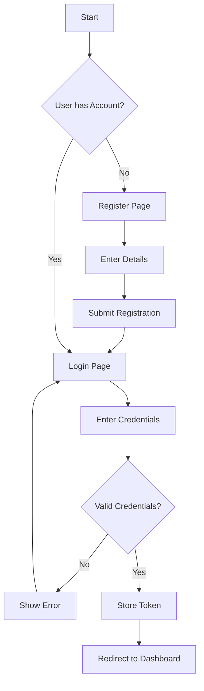
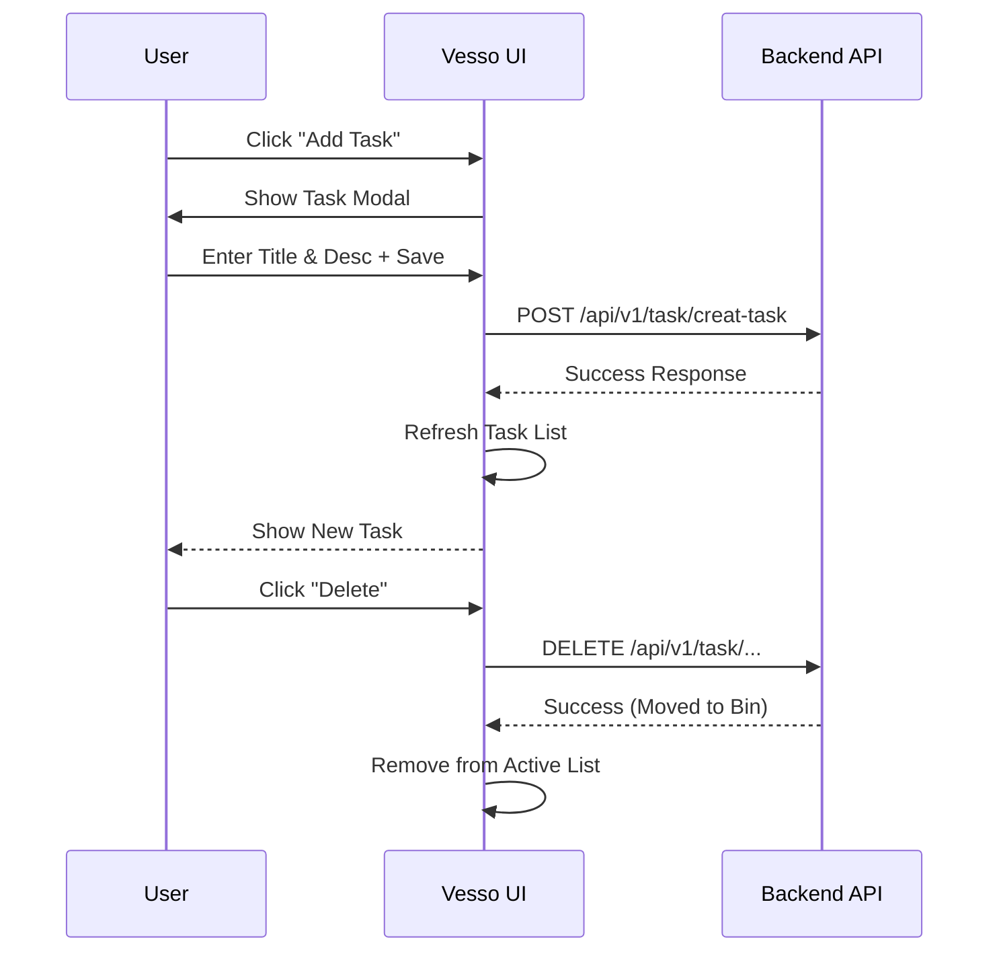

# Vesso - The Task Manager

Vesso is a modern, intuitive, and efficient task management application designed to help you organize your daily activities. With a clean user interface and robust functionality, Vesso makes staying productive effortless.

## 🚀 Live Demo

Check out the live application here:
**[Vesso - The Task Manager](https://vesso-the-task-manager-f.vercel.app)**

---

## ✨ Features

- **User Authentication**: Secure Login and Registration system.
- **Task Management**:
    - **Create**: Add new tasks with titles and descriptions.
    - **Read**: View all your tasks in a clean list format.
    - **Update**: Edit existing tasks easily.
    - **Delete**: Remove tasks you no longer need.
- **Recycle Bin**: Deleted tasks are moved to a bin where they can be reviewed before permanent deletion.
- **Responsive Design**: Works seamlessly on desktops, tablets, and mobile devices.

---

## 🛠️ Tech Stack

- **Frontend**: HTML5, CSS3, JavaScript (ES6+)
- **Backend API**: Node.js / Express (connected via API)
- **Deployment**: Vercel

---

## 📊 Architecture & Flow

### User Authentication Flow


### Task Management Flow


---

## 📦 Installation & Setup

To run the frontend locally:

1.  **Clone the repository**:
    ```bash
    git clone <your-repo-url>
    cd Task_Manager_Frontend
    ```

2.  **Open `index.html`** or serve with a local server (e.g., Live Server in VS Code).

3.  **Configuration**:
    The application is configured to detect `localhost`. Ensure your backend is running or update `js/config.js` if necessary.

---

## 🤝 Contributing

Contributions are welcome! Please feel free to open issues or submit pull requests.

---

&copy; 2025 Vesso. All rights reserved.
