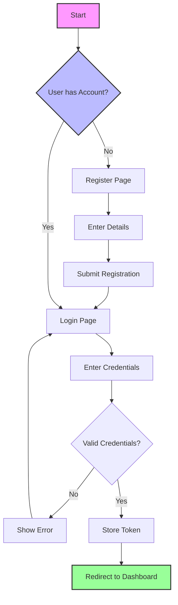
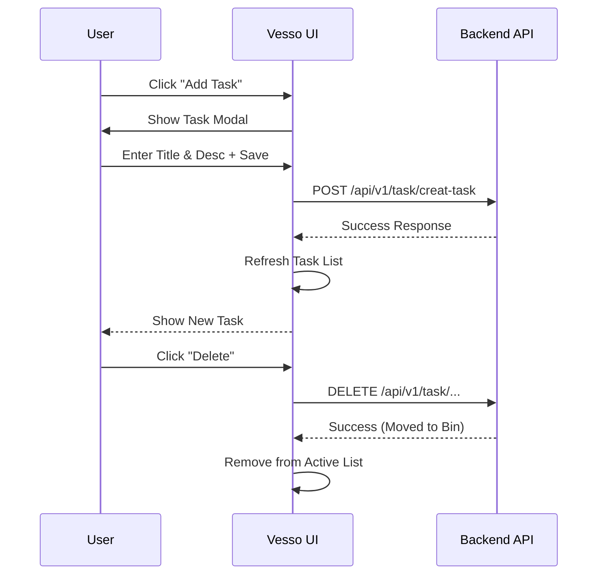

<div align="center">

# 📝 Vesso - The Task Manager

[](https://vesso-the-task-manager-f.vercel.app)
[](https://nodejs.org/)
[](LICENSE)

**A modern, intuitive, and efficient task management application designed to organize your daily life.**

<br />

### [🚀 Launch Live Demo Application](https://vesso-the-task-manager-f.vercel.app)

</div>

---

## 🌟 Overview

**Vesso** reimagines productivity with a clean, user-centric interface. Whether you are managing personal to-dos or planning a project, Vesso offers a seamless experience to keep you on track. Built with performance and simplicity in mind, it works flawlessly across all your devices.

---

## ✨ Key Features

| Feature | Description |
| :--- | :--- |
| **🔐 Secure Auth** | Robust user registration and login system to keep your data safe. |
| **📝 Smart CRUD** | Create, Read, Update, and Delete tasks with instant UI updates. |
| **♻️ Recycle Bin** | Never lose a task by accident. Recover deleted tasks from the bin. |
| **📱 Responsive** | Optimized for Desktop, Tablet, and Mobile experiences. |
| **⚡ Fast & Fluid** | Built with vanilla JavaScript for maximum performance and zero bloat. |

---

## 🛠️ Technology Stack

- **Frontend**: 
  -  
  -  
  - 
- **Backend**: 
  -  
  - 
- **Deployment**: 
  - 

---

## 📊 System Architecture

### 🔐 Authentication Flow


### 📋 Task Lifecycle


---

## 📦 Local Installation

Follow these steps to get the project running on your local machine.

1.  **Clone the Repository**
    ```bash
    git clone https://github.com/mahammadanish321/Vesso-The_task_manager_F.git
    cd Task_Manager_Frontend
    ```

2.  **Launch the Application**
    Open `index.html` in your browser or use a simplified development server:
    - **VS Code**: Right-click `index.html` and select "Open with Live Server".
    - **Python**: `python -m http.server`

3.  **Local Configuration** (Optional)
    The app automatically detects `localhost`. If your backend is running on a different port than `8000`, update `js/config.js`.

---

## 🤝 Contributing

We welcome contributions!
1. Fork the Project
2. Create your Feature Branch (`git checkout -b feature/AmazingFeature`)
3. Commit your Changes (`git commit -m 'Add some AmazingFeature'`)
4. Push to the Branch (`git push origin feature/AmazingFeature`)
5. Open a Pull Request

---

<div align="center">

**&copy; 2025 Vesso Task Manager**. Made with ❤️ by [Mahammad Anish](https://github.com/mahammadanish321).

</div>
